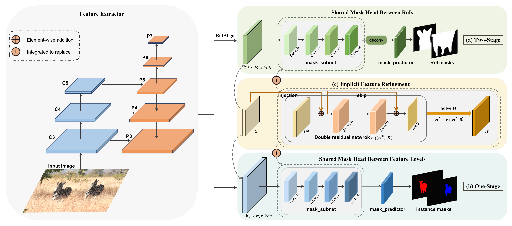

# Implicit Feature Refinement for Instance Segmentation

This repository is an official implementation of the ACM Multimedia 2021 paper [Implicit Feature Refinement for Instance Segmentation](https://dl.acm.org/doi/abs/10.1145/3474085.3475449).

## Introduction

**TL; DR.** Implicit feature refinement (IFR) enjoys several advantages: 1) simulates an infinite-depth refinement network while only requiring parameters of single residual
block; 2) produces high-level equilibrium instance features of global receptive field; 3) serves as a general plug-and-play module easily extended to most object recognition frameworks.
# 

## Get Started

1. Install [cvpods](https://github.com/Megvii-BaseDetection/cvpods) following the instructions

```shell
# Install cvpods
git clone https://github.com/Megvii-BaseDetection/cvpods.git
cd cvpods 
## build cvpods (requires GPU)
python3 setup.py build develop
## preprare data path
mkdir datasets
ln -s /path/to/your/coco/dataset datasets/coco
```

2. To save the training and testing time, the explicit form of our IFR, annotated with "weight_sharing", is provided on [mask_rcnn](https://github.com/lufanma/IFR/tree/main/mask_rcnn.res50.fpn.coco.multiscale.weight_sharing.1x) to achieve competitive performance.


3. For fast evaluation, please download trained model from [here](https://drive.google.com/drive/folders/1T2I_HtHDCOu2i_iamizytwJ5VC_mivmM?usp=sharing).


3. Run the project

```shell
git clone https://github.com/lufanma/IFR.git

# for example(e.g. mask_rcnn.ifr)
cd IFR/mask_rcnn.ifr.res50.fpn.coco.multiscale.1x/

# train
sh pods_train.sh

# test
sh pods_test.sh
# test with provided weights
sh pods_test.sh \
    MODEL.WEIGHTS /path/to/your/save_dir/ckpt.pth # optional
    OUTPUT_DIR /path/to/your/save_dir # optional
```

## Results

|  Model  |   AP   |  AP50  |  AP75  |  APs   |  APm   |  APl   |  Link  |
|:-------:|:------:|:------:|:------:|:------:|:------:|:------:|:------:|  
| mask_rcnn.ifr.res50.fpn.coco.multiscale.1x | 35.162 | 56.245 | 37.576 | 16.898 | 37.393 | 50.791 | [download]()
| mask_rcnn.res50.fpn.coco.multiscale.weight_sharing.1x | 35.162 | 56.245 | 37.576 | 16.898 | 37.393 | 50.791 | [download]()
| cascade_rcnn.ifr.res50.fpn.coco.800size.1x | 35.162 | 56.245 | 37.576 | 16.898 | 37.393 | 50.791 | [download]()


## Citing IFR
If you find IFR useful to your research, please consider citing:
```
@inproceedings{ma2021implicit,
  title={Implicit Feature Refinement for Instance Segmentation},
  author={Ma, Lufan and Wang, Tiancai and Dong, Bin and Yan, Jiangpeng and Li, Xiu and Zhang, Xiangyu},
  booktitle={Proceedings of the 29th ACM International Conference on Multimedia},
  pages={3088--3096},
  year={2021}
}
```
